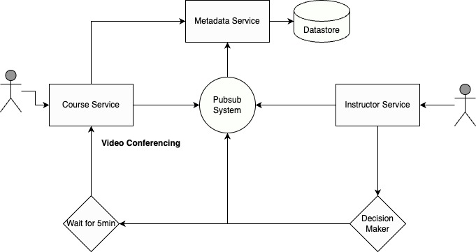
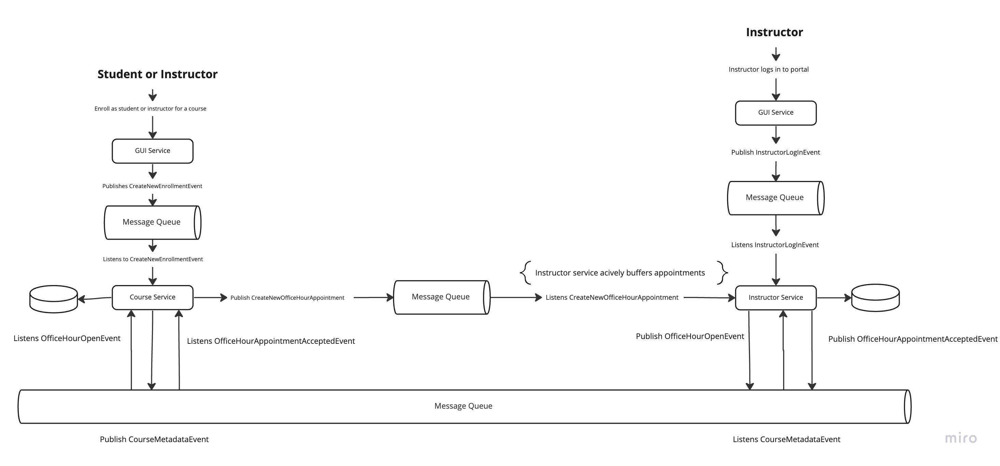
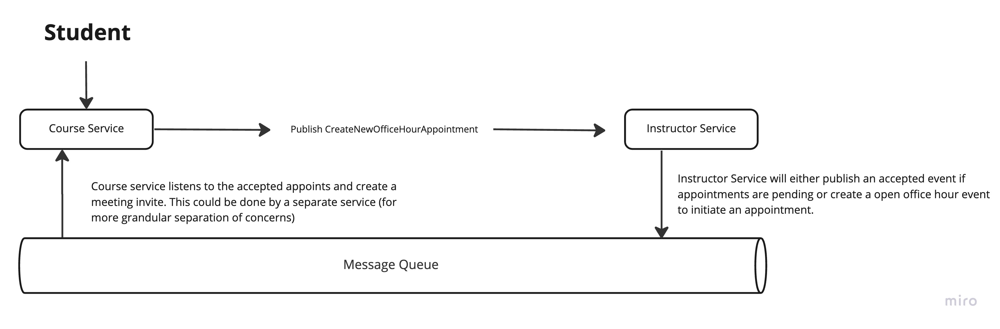

# Problem
1. Students may queue up for office hours at any time.
2. Teaching assistants may open office hours at any time.
3. When a teaching assistant opens office hours, the next student in line is sent a notification, and they have 5 minutes to click the link in that notification.
  a. If they click the link, they go into a video conference with the TA. We can assume the video conferencing system is a separate problem entirely and we need not consider it here.
  b. If they do not click the link within 5 minutes, it expires. The teaching assistant is then allowed to request that the next person in line be notified.
4. After each student session the teaching assistant may request the next student in line to start another session. (It does not happen automatically.)
5. There may be multiple teaching assistants for a course, and they may have office hours at any time (possibly different times, possibly the same time). All students go into the same line per course, and may not choose their teaching assistant.

# Requirements

### Functional Requirement
* Students should be able to enroll / disenroll in the course
* Students should be able to schedule time for office hours
* Students should be able to cancel their office hour meeting
* Instructor should be able to assist students waiting in the office hours

### Non-Functional Requirement
- Event driven design
- Define events, actions and logic to respond to the events
- Data model, in memory or persistent

# High Level Design (Service-Driven Approach)
First let's design the system using service-driven architecture. The main components of the system includes: users, course service, instructor service, metadata service, and pubsub system.



### Schema Design

```
Table: Student
    - Unique ID
    - Name
    - Status

Table: Instructor
    - Unique ID
    - Name
    - Status
```
```
Table: Course
    - Course ID
    - Course Name
    - Course Desc

Table: CourseStudent
    - Student ID
    - Course ID

Table: CourseInstructor
    - Instructor ID
    - Course ID
```

### Design Workflow
* Students and Instructors both will be part of our the users table. User table will have a field as type that will represent the user_type (student, instructor, observer, etc). 
* Metadata service is responsible for managing the entire metadata for the system. This includes tables like - student, instructor, course, course user, course instructor etc. We may also include queue related information on the metadata table as well. 
* Course service is the point of entry for the students. Course service is responsible for managing everything related to course including: enrollment, assignement, and collaborations. Course service interacts with the metadata service and the pubsub system to fetch the metadata related to the course and notify instructors about student's progress.
* Instructor service is the point of entry for the instructors. It includes an admin panel for the instructors to monitor the student's progress for the courses they are assigned for. Instructor service listens to the pubsub system periodically and updates all the instructors if there are students waiting to ask questions or discuss. 
    * Once an instructor is available they can choose to accept or ignore the notification. When an instructor accepts the notification, an acknowledgement is sent to the pubsub system to take the current student in the waiting line. And an email notification is sent to the course service. Instructor may wait for 5min, then cancel if the student doesn't join. 
* Pubsub system is responsible for managing the office_hour queue. It includes a cluster manager that is responsible for creating, deleting the queues and items. Items in the queue are ordered FIFO (best effort), we can also include a timestamp on the course service side which can then re-order the messages in case strict ordering needs to be maintained. 

# High Level Design (Event-Driven Approach)
The above design is a typical service-oriented implementation, however, we see many areas where we can make significant improvements using event-driven architecture. As seen earlier, there are 5 main components of the system we shall reuse the components as is - users (students and instructors), course service, instructor service, pubsub system, and storage. 



### Schema Design

```
Table: User
    - User ID
    - Name
    - Status
    - Role (Student, Mentor, Observer)
```

```
Table: Course
    - Course ID
    - Course Name
    - Course Description

Table: CourseStudent
    - User ID (as StudentID)
    - Course ID

Table: CourseInstructor
    - User ID (as InstructorID)
    - Course ID
```

### Events
```
CreateNewEnrollmentEvent {
    Metadata: {
        "eventId" : 1234,
        "eventName": "CreateNewEnrollmentEvent",
        "timestamp" : 123232903290,
    },
    UserID: 1239894,
    RoleType: Student / Instructor / Observer,
    Status: REQUEST_FOR_ENROLLMENT
}

CreateNewOfficeHourAppointment {
    Metadata: {
        "eventId": 9999,
        "eventName": "CreateNewOfficeHourAppointment",
        "timestamp": 39203920
    },
    CourseID: 23232,
    StudentID: 123232
}

OfficeHourOpenEvent {
    Metadata: {
        "eventId": 8888,
        "eventName": "OfficeHourOpenEvent",
        "timestamp": 3920399920
    },
    CourseID: 23223,
    InstructorID: 5554
}

CourseMetadataEvent {
    Metadata: {
        "eventId": 7777,
         "eventName": "CourseMetadataEvent",
        "timestamp": 0090343
    },
    User: [{
        UserID: 39434,
        Role: Student
    }]
    Course: [{
        CourseID: 000
    }],
    CourseStudent: [{
        StudentID: 999,
        CourseID: 9000
    }],
    CourseInstructor: [{
        CourseID: 323,
        InstructorID: 9999
    }]
}

InstructorLogInEvent {
    Metadata: {
        "eventId": 7664,
        "eventName": "InstructorLogInEvent",
        "timestamp": 23232
    },
    InstructorID: 3847,
    Status: Active
}

OfficeHourAppointmentAcceptedEvent {
    Metadata: {
        "eventId": 4444,
        "eventName": "OfficeHourAppointmentAcceptedEvent",
        "timestamp": 2322323232
    },
    CourseID: 7777,
    StudentID: 434343,
    InstructorID: 909000
}

```

### Design Workflow

* Students and Instructors will enroll themselves in a course. GUI publishes a **CreateNewEnrollmentEvent** to the message queue. The enrollment event will contain information about the user and its role. Role is used to differentiate different types of users (student, observer, instructor, etc). This data is additionally maintained in the Users table in the datastore. The enrollment event additional creates two association tables - course_user and course_instructor.

* Course is responsible for managing and tracking student's progress. The service listens to the **CreateNewEnrollmentEvent** and reacts by storing the data in the database. Though the event queue can be used as a source of truth, we also maintain the data in the datastore for further durability and domain specific access patterns. Course service offers following functionalities: 
  * Only students that are enrolled in the course will have access to its materials and the assigned instructors. Once the students get enrolled, they can proceed to take the course. Instructors are available entirely through the course's journey (instructors may change during the student's journey with the course, however, a minimum number of instructors will always be available to the students)
  * Course service also maintains metadata about the course, students, and instructors assigned to the course. Course service also publishes the course metadata **CourseMetadataEvent** to other dependent services. During the course's lifecycle a student may want to interact with an instructor, they can simply publish a **CreateNewOfficeHourAppointmentEvent**. To coordinate the interaction, the course services publishes a new appointment event and actively listens two more events - **OfficeHourOpenEvent** and **OfficeHourAppointmentAcceptedEvent**. 

* Instructor service acts as the entry point for instructors. It allows instructors to add or remove content, track student's progress, collaborate 1-1 with the student, and add grading. Instructors open office hours at any time by simply logging in to the instructor portal which triggers **InstructorLogInEvent** and also does the following:
  * Instructor service will immediately publish **OfficeHourEvent** to notify the students assigned to their course. If the service has active appointments **CreateNewOfficeHourAppointmentEvent**, they are made available to the instructor. If the instructor chooses to accept the appointment the service publishes **OfficeHourAppointmentAcceptedEvent** acknowledging the appointment to the student. Items are removed from the queue immeditely after the appointment is accepted (we don't want for the student to accept the invite)
  * Instructor service buffers the event **CreateNewOfficeHourAppointmentEvent** internally. This buffer is used to inform all instructors assigned to the course that there are students waiting in the office lobby. Once the instructor accepts the appointment the service publishes **OfficeHourAppointmentAcceptedEvent** that will notify the student with a meeting invite. Instructor will join the meeting and wait for 5min for the student show up. 
  
* Students are infromed about the office hours via the **OfficeHourOpenEvent**. They will then join the office hour waiting room by initiating the **CreateNewOfficeHourAppointmentEvent** for their chance to come up (FIFO basis). Instructor may choose next student in line by accepting the next appointment event which then publishes **OfficeHourAppointmentAcceptedEvent**. Instructors don't necessarily choose the next student, it is done automatically by the message queue as the queue is in FIFO order. Items are removed from the queue immeditely after the appointment is accepted. 



### Additional Improvements
We assume the following, those students that have published an appointment first will be given the prirotity even though they may have iniaited the request many hours ago. It is the students responsibility to join the meeting when an instructor makes an invite. 

We can further improve the system by adding a batching and prioritization service that reject the students that are waiting for more than an hour, and pushes the currently active students to the top of the queue.  

### Pubsub System
Responsible for maintain the events and uses best-effort FIFO ordering.

## References
* https://learn.microsoft.com/en-us/azure/architecture/guide/architecture-styles/event-driven
* Building Event-Driven Microservices, Adam Bellemare
* Designing Event-Driven System with Apache Kafka, Ben Stopford
* Practical Event-Driven Microservices Architecture, Hugo Filipe Oliveira
